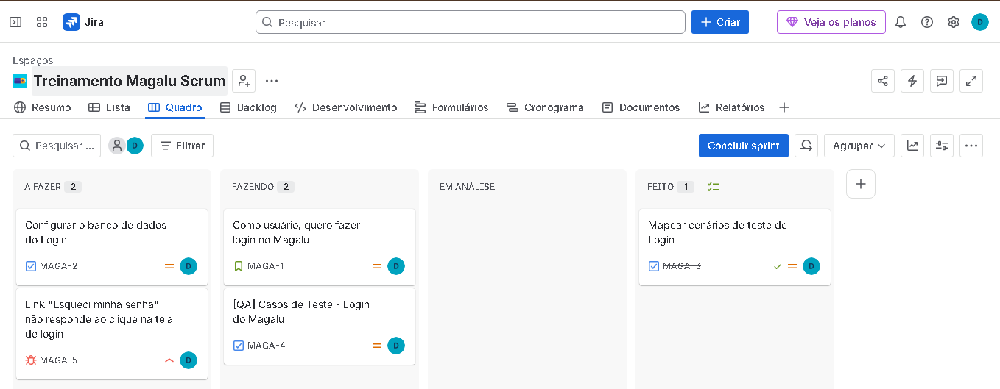
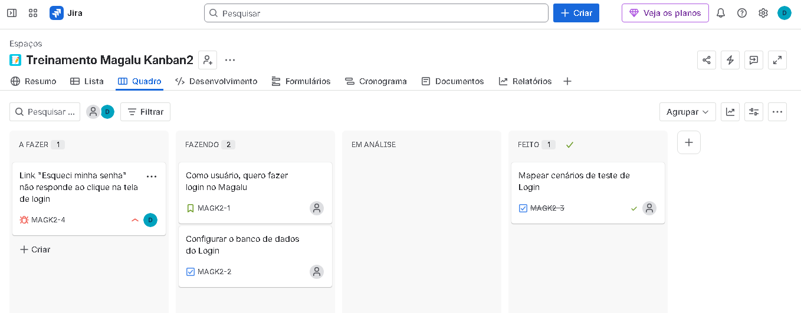

# 🚀 Portfólio de QA: Gestão Ágil e Ciclo de Vida de Bugs com Jira Software

Este repositório foi criado para documentar e demonstrar minhas habilidades práticas em Engenharia de Qualidade de Software (QA) e Metodologias Ágeis (Scrum e Kanban). 

Durante este projeto prático, simulei o fluxo de desenvolvimento e testes do e-commerce do **Magazine Luiza (Magalu)**, utilizando o **Jira Software** como ferramenta principal para o gerenciamento de tarefas, histórias de usuário, critérios de aceitação e documentação de defeitos.

---

## 📊 Projeto 1: Metodologia Scrum (Ciclo de Sprint)

No primeiro cenário, simulei a atuação de um QA inserido em um time utilizando o framework **Scrum**. 

### O que foi desenvolvido:
* **Gestão de Backlog:** Criação e refinamento de Histórias de Usuário (*User Stories*) e Tarefas Técnicas (*Tasks*).
* **Planejamento de Testes:** Elaboração de Cenários de Teste (Cenários Positivos e Negativos) para a funcionalidade de Login.
* **Execução e Fechamento:** Ativação e gerenciamento do ciclo de vida de uma Sprint até a entrega dos cartões em "Feito".

### 📸 Evidência do Quadro Scrum:

---

## 📈 Projeto 2: Metodologia Kanban (Fluxo Contínuo)

No segundo cenário, montei um quadro **Kanban** dinâmico para analisar a diferença na gestão visual do fluxo contínuo em comparação com as Sprints fechadas do Scrum.

### Diferenciais Práticos Experimentados:
* **Fluxo Imediato:** Compreensão do conceito onde os itens criados entram direto na coluna "A Fazer", sem a necessidade de um Backlog separado.
* **Gerenciamento de WIP (Work in Progress):** Aplicação de limites de trabalho em andamento para evitar gargalos nas colunas produtivas.

### 📸 Evidência do Quadro Kanban:

---

## 🐞 Documentação de Defeitos (Bug Report)

Como parte fundamental das atividades de QA, identifiquei e registrei formalmente uma falha crítica no fluxo de autenticação do usuário.

### Ticket Registrado no Jira: `MAGK2-4`
* **Título:** Link "Esqueci minha senha" não responde ao clique na tela de login.
* **Prioridade:** Alta (High).
* **Passos para reprodução:**
    1. Acessar a tela de login do Magalu.
    2. Clicar no link "Esqueci minha senha".
* **Resultado Obtido:** O link é clicado, mas a página permanece completamente estática, nenhuma mensagem é exibida e nenhuma ação ocorre.
* **Resultado Esperado:** O usuário deve ser redirecionado com sucesso para a tela de inserção do e-mail de recuperação de senha.

---

## 🛠️ Tecnologias e Ferramentas Utilizadas
* **Jira Software:** Ferramenta oficial para gerenciamento de projetos ágeis e controle de bugs.
* **Metodologias Ágeis:** Scrum e Kanban aplicados na prática de QA.
* **Markdown:** Para estruturação desta documentação.
